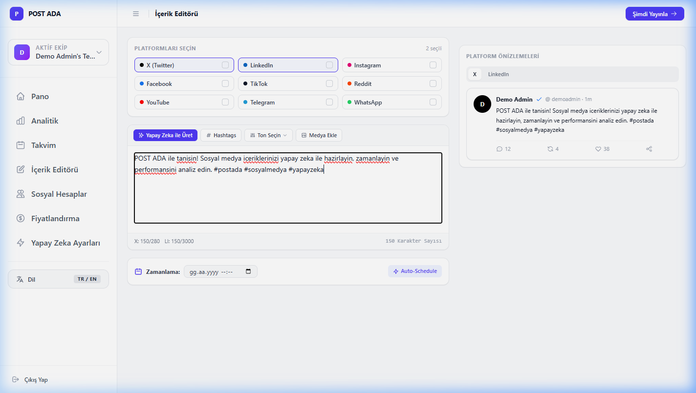
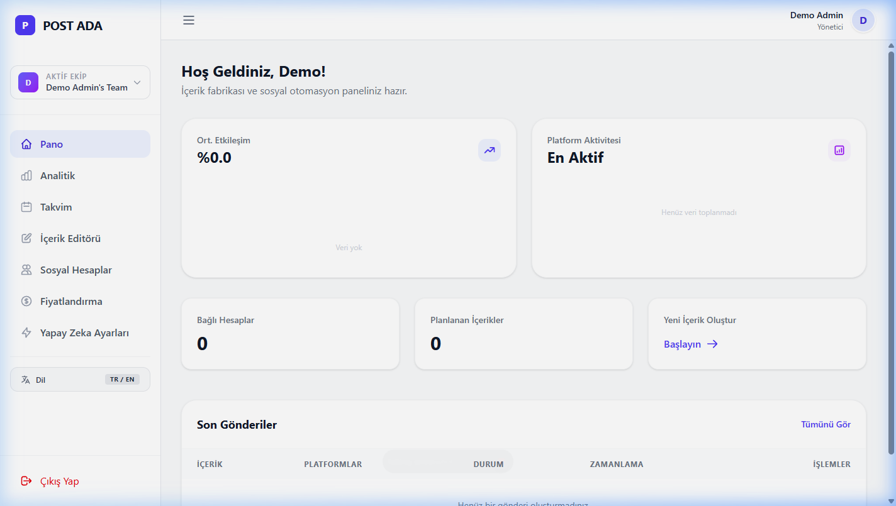
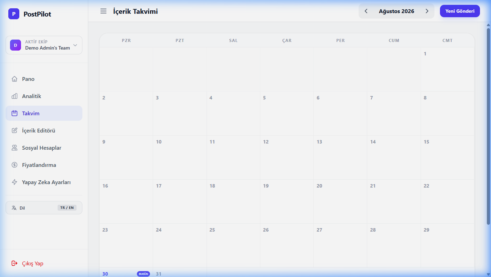

<div align="center">

# POST ADA

**Next-Generation Multi-Platform Social Media Automation & AI Intelligence Suite**

<p align="center">
  <a href="README.md"><b>English</b></a> • <a href="README.tr.md"><b>Türkçe</b></a>
</p>

[](https://laravel.com)
[](https://php.net)
[](https://livewire.laravel.com)
[](https://tailwindcss.com)
[](https://phpunit.de)
[](https://adacreative.co)

<br />

POST ADA is a high-performance, multi-tenant social media management, automation, and AI content generation platform engineered for creative agencies, brands, and modern creators.

</div>

---

## Project Status

The platform is currently in **Active Development (Beta / MVP Stage)**. All core UI workflows, database architectures, preview engines, and test suites are 100% operational in local development.

### Implementation Matrix

| Component | Status | Details |
| :--- | :--- | :--- |
| **Post Composer & Live Previews** | Completed | 9 platform mockups (X, LinkedIn, IG, TikTok, FB, Reddit, YT, Telegram, WhatsApp) with pure SVG vector actions. |
| **Visual Calendar & Scheduling** | Completed | Monthly/weekly scheduling matrix powered by `AutoScheduleService` slot calculation. |
| **AI Content Intelligence** | Completed | Caption generation, hashtag curation, and 5-tone adaptation via Gemini & OpenAI GPT-4o. |
| **Consolidated Analytics** | Completed | Performance charts, engagement metrics, top posts breakdown, and PDF export triggers. |
| **Team Management & Isolation** | Completed | Multi-tenant team workspace isolation, member roles, and active team context switching. |
| **Billing & Credits Engine** | Completed | Package management, credit transactions, and checkout redirect lifecycle. |
| **Test Suite Coverage** | Completed | 22/22 PHPUnit unit & feature test suites passing at 100%. |
| **Live Social Publishing APIs** | In Progress | OAuth callback flows are ready; live API v2 publishing drivers (X, Meta, LinkedIn) require developer app keys in `.env`. |
| **Payment Webhook Verification** | In Progress | Transaction schema complete; requires live Shopier merchant credentials and HTTPS callback exposure. |
| **Dedicated Landing Page** | Planned | Public marketing landing page design in progress. |

---

## Visual Showcase

### 1. Multi-Platform Composer & Real-Time Live Previews
Unified post editor with instant format adaptation and realistic previews for 9 social channels.



---

### 2. Consolidated Analytics & Growth Dashboard
Real-time tracking of follower metrics, publication velocity, and cross-channel performance indicators.



---

### 3. Visual Social Calendar & Auto-Scheduling Matrix
Interactive monthly/weekly scheduling matrix powered by automated optimal time slot allocation.



---

## Core Capabilities

- **Unified Multi-Platform Post Composer**
  - Real-time live previews tailored specifically for 9 major social networks: X (Twitter), LinkedIn, Instagram, TikTok, Facebook, Reddit, YouTube, Telegram, and WhatsApp.
  - Native format constraint validation (character counters, media limits, thread handling).
  - Integrated media library with instant attachment and multi-file staging.

- **AI Content Intelligence Suite**
  - Multi-engine support (Google Gemini & OpenAI GPT-4o) for automated caption generation, smart hashtag curation, and instant tone adaptation (Professional, Friendly, Creative, Humorous, Informative).
  - AI image generation bridge (DALL-E 3 / Imagen).

- **Smart Timing & Auto-Scheduling**
  - Algorithmic optimal time slot allocation based on custom per-day schedule matrices (`schedule_slots`).
  - Asynchronous dispatch queue for multi-account simultaneous publication.

- **Comprehensive Analytics & Export Engine**
  - Consolidated engagement tracking, follower growth metrics, and platform performance breakdowns.
  - Automated PDF/CSV performance audit report generation.

- **Team Collaboration & Multi-Tenancy**
  - Granular team workspace isolation, role-based member permissions, and instant workspace context switching.

- **Billing & Credit System**
  - Tiered credit package management with automated gateway integrations (Shopier).

---

## Supported Social Networks

| Platform | Channel Type | Preview Adapter | Constraints |
| :--- | :--- | :--- | :--- |
| **X (Twitter)** | Microblogging | Tweet card with meta & actions | 280 chars, 4 media items |
| **LinkedIn** | Professional Network | Business post card with reactions | 3,000 chars, single/multi image |
| **Instagram** | Visual / Media | Square feed post & Story mockup | 2,200 chars, square ratio |
| **TikTok** | Short Video | 9:16 vertical full-screen frame | 2,200 chars, vertical video |
| **Facebook** | Social Feed | Page/Group publication card | 63,206 chars, multi-attachment |
| **Reddit** | Community / Forum | Subreddit discussion card & voting | 40,000 chars, markdown |
| **YouTube** | Community Feed | Community post & media banner | 10,000 chars |
| **Telegram** | Direct Broadcast | Chat bubble with verified read ticks | 4,096 chars |
| **WhatsApp** | Direct Messaging | Chat bubble with delivery ticks | 65,536 chars |

---

## Technology Stack

| Layer | Technology |
| :--- | :--- |
| **Backend Framework** | Laravel 12 (PHP 8.5.x) |
| **Reactive UI** | Livewire 3 + Alpine.js |
| **Styling & Design System** | Tailwind CSS v4 + Vanilla CSS Design Tokens |
| **Database Engine** | SQLite (Development) / MySQL 8.0+ / PostgreSQL (Production) |
| **Queue & Caching** | Redis / Database Driver |
| **Asset Pipeline** | Vite 7 |
| **Testing Framework** | PHPUnit 11 |

---

## System Requirements

- **PHP**: `>= 8.3` (Optimized for `PHP 8.5.x`)
  - Required Extensions: `pdo`, `pdo_sqlite` / `pdo_mysql`, `curl`, `mbstring`, `openssl`, `tokenizer`, `xml`, `ctype`, `json`, `bcmath`
- **Composer**: `>= 2.7`
- **Node.js**: `>= 20.x`
- **NPM**: `>= 10.x`

---

## Quickstart Installation

### 1. Clone Repository
```bash
git clone https://github.com/adacreativeco/postada.git
cd postada
```

### 2. Install Dependencies
```bash
composer install
npm install
```

### 3. Environment Setup
```bash
cp .env.example .env
php artisan key:generate
```

### 4. Database Setup & Migrations
```bash
touch database/database.sqlite
php artisan migrate
```

### 5. Build Assets
```bash
npm run build
```

### 6. Start Local Development
```bash
# Terminal 1 - Local Web Server
php artisan serve --port=8088

# Terminal 2 - Vite Live Server (Optional for hot module reload)
npm run dev

# Terminal 3 - Queue Worker
php artisan queue:listen
```

The application will be accessible at: `http://localhost:8088`

---

## Environment Configuration

Configure your `.env` file with the following service credentials:

```ini
APP_NAME="POST ADA"
APP_ENV=local
APP_KEY=
APP_DEBUG=true
APP_URL=http://localhost:8088

# Database
DB_CONNECTION=sqlite

# AI Content Services
GEMINI_API_KEY=your_gemini_api_key
OPENAI_API_KEY=your_openai_api_key

# Payment Gateway (Shopier)
SHOPIER_API_KEY=your_shopier_key
SHOPIER_API_SECRET=your_shopier_secret
SHOPIER_WEBSITE_INDEX=1

# Social Media OAuth Credentials
TWITTER_CLIENT_ID=
TWITTER_CLIENT_SECRET=
TWITTER_REDIRECT_URI="${APP_URL}/auth/twitter/callback"

LINKEDIN_CLIENT_ID=
LINKEDIN_CLIENT_SECRET=
LINKEDIN_REDIRECT_URI="${APP_URL}/auth/linkedin/callback"

FACEBOOK_CLIENT_ID=
FACEBOOK_CLIENT_SECRET=
FACEBOOK_REDIRECT_URI="${APP_URL}/auth/facebook/callback"
```

---

## Testing & Quality Assurance

The test suite covers full architecture integrity, feature routing, team isolation, scheduling algorithms, and Livewire component rendering.

```bash
# Run all automated tests
php artisan test

# Run via PHPUnit binary
vendor/bin/phpunit
```

All 22 unit & feature test suites maintain 100% pass status.

---

## Architecture & Directory Structure

```
postada/
├── app/
│   ├── Http/Controllers/     # Standard HTTP & OAuth callback controllers
│   ├── Livewire/             # Reactive full-page Livewire components
│   │   ├── AccountSettings.php
│   │   ├── AISettings.php
│   │   ├── Analytics.php
│   │   ├── Calendar.php
│   │   ├── Dashboard.php
│   │   ├── MediaLibrary.php
│   │   ├── PostEditor.php
│   │   ├── Pricing.php
│   │   ├── ScheduleSettings.php
│   │   ├── SocialManager.php
│   │   └── TeamSettings.php
│   ├── Models/               # Eloquent data models (User, Post, Team, Package, etc.)
│   └── Services/             # Dedicated business logic domain services
│       ├── AI/               # AIContentService (Gemini / OpenAI bridge)
│       ├── Payment/          # PaymentService (Shopier payment lifecycle)
│       ├── Post/             # PostPublishService & Social API connectors
│       └── Scheduling/       # AutoScheduleService (smart slot calculation)
├── database/
│   ├── migrations/           # Normalized database schema migrations
│   └── seeders/              # Initial data & credit package seeders
├── resources/
│   ├── css/                  # Design system tokens & Tailwind imports
│   ├── js/                   # Frontend initialization & client scripts
│   └── views/
│       ├── components/       # Reusable Blade UI components (sidebar, navigation)
│       └── livewire/         # Livewire template views & platform preview cards
├── routes/
│   ├── web.php               # Authenticated application & webhook routes
│   └── console.php           # Scheduled tasks & artisan commands
└── tests/
    ├── Feature/              # End-to-end user workflows & controller tests
    └── Unit/                 # Service isolation & model logic tests
```

---

## License & Intellectual Property

Copyright © ADA Creative Co. All Rights Reserved.  
This software and associated documentation files are proprietary and confidential. Unauthorized copying, distribution, modification, or commercial exploitation is strictly prohibited without prior written consent from **ADA Creative Co.**
